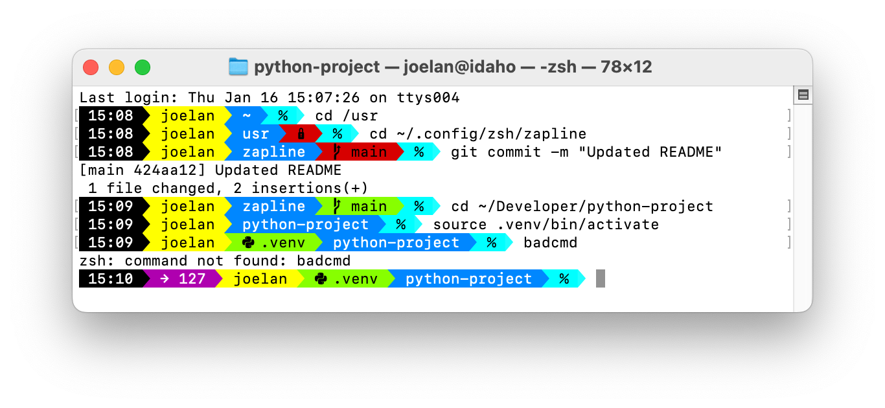

Zapline - A pure Zsh Powerline PS1 command prompt
=================================================



Zapline is a [Powerline](https://github.com/powerline/powerline)-style prompt for the Zsh shell written in Zsh script. It aims to provide an attractive and functional prompt that requires minimal setup and dependencies.

Zapline is adapted from [PureLine](https://github.com/chris-marsh/pureline), which provides a similar prompt for the Bash shell.

### Main features

* Pure shell script
* Configurable segments
* Should work out of the box with no additional config on most terminals

## Setup

### Install

#### Full install via git clone

```
% cd
% git clone https://github.com/jcjeffreys/zapline.git
% cp zapline/configs/basic.conf ~/.zapline.conf
```

* Source the `zapline` script by adding the following to your `.zshrc`:

    `source ~/zapline/zapline ~/.zapline.conf`

#### Minimal install via download

* Download the `zapline` script from this repository
* Source the `zapline` script by adding the following to your `.zshrc`:

    `source path/to/zapline`

### Configuration

Zapline will run a reasonable replacement for the default prompt without any configuration file loaded.

Some example configuration files are provided.
* `basic.conf`
    * enables some useful segments from the `zapline` script
    * does not require Powerline fonts
    * uses standard colors
* `macos-powerline.conf`
    * enables extended functionality from external scripts
    * includes Powerline glyphs
    * supports connection via SSH from machine without Powerline fonts
    * uses pretty colors that work well in the macOS Terminal.app


To use the Powerline-style config, you must install and use a patched font. Download one [here](https://github.com/powerline/fonts) or patch your own font using the [Powerline font patcher](https://github.com/powerline/fontpatcher).